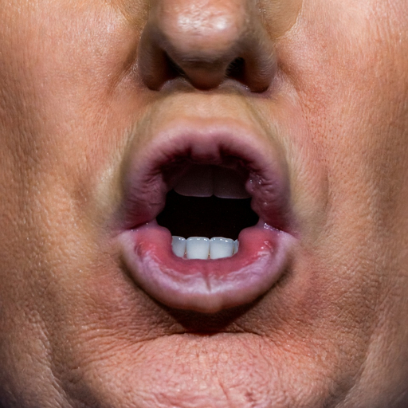

<p align="center">
  
</p>

# Make Super Earth Great Again

A Helldivers 2 voice mod that replaces **Helldiver Voice 4** (Default Male 4) with 336 AI-generated Trump voice lines, category-matched to all 785 in-game callouts.

Reload? "Hold on, I'm reloading, okay?" Grenade? "You're fired!" Bughole? "Nasty! Very nasty!"

https://github.com/trashguy/make-super-earth-great-again/raw/master/showcase/Make-Super-Earth-Great-Again-Showcase.mp3

**Client-side only** — other players will not hear your modded voice lines.

## Install

Download the latest zip from [Releases](https://github.com/trashguy/make-super-earth-great-again/releases).

### Arsenal (recommended)

Drag and drop the zip onto Arsenal's mod list. Done.

Or use **Add Mod > Files** and select the zip.

### Other mod managers (HD2ModManager, h2mm-cli)

Import the zip through the mod manager's import function.

### Manual

Copy both files from the zip to your game's data folder:

```
Helldivers 2/data/ce6b3d08283efc3d.patch_0
Helldivers 2/data/ce6b3d08283efc3d.patch_0.stream
```

**Linux (Steam/Proton):**
```bash
cp ce6b3d08283efc3d.patch_0 ce6b3d08283efc3d.patch_0.stream \
   ~/.local/share/Steam/steamapps/common/Helldivers\ 2/data/
```

Then select **Default Voice 4** in your helldiver's appearance settings in-game.

## Uninstall / Restore Original Voices

Delete the two patch files from `Helldivers 2/data/`, or remove through your mod manager.

```bash
rm ~/.local/share/Steam/steamapps/common/Helldivers\ 2/data/ce6b3d08283efc3d.patch_0*
```

The mod never modifies original game files. It adds patch files that the engine loads on top of the base audio. Remove the patches and the originals come back automatically. No file verification or reinstall needed.

## Game Updates

When Helldivers 2 updates, the mod may need to be rebuilt. Check back for a new release matching the latest game build.

Release versions are tagged `v1.0.0-hd22468630` where the suffix is the HD2 Steam build ID.

## What's Replaced

336 unique Trump voice lines across all categories:

| Category | Lines | Examples |
|----------|-------|---------|
| Combat / Kills | 21 | "We're winning so much! So much winning!" |
| Reloading | 26 | "Hold on, I'm reloading, okay?" |
| Grenades | 5 | "You're fired!" |
| Enemy Callouts | 27 | "Bugs! Disgusting bugs! Nasty!" |
| Stratagems | 43 | "Orbital coming in! This is gonna be huge!" |
| Injury / Damage | 27 | "They got my arm! This is terrible!" |
| Healing | 23 | "I feel incredible. The best I've ever felt." |
| Deployment | 14 | "Your favorite president has landed!" |
| Patriotic | 21 | "Make Super Earth great again!" |
| Pings / Directions | 49 | Directions, numbers, callouts |
| And more... | 80+ | Samples, pickups, extraction, etc. |

## Credits

- [Fish Audio](https://fish.audio) — AI voice generation (POTUS 47 model)
- [hd2-audio-modder](https://github.com/RaidingForPants/hd2-audio-modder) — HD2 audio patch generation
- [OpenAI Whisper](https://github.com/openai/whisper) — Voice line transcription matching
- [vgmstream](https://github.com/vgmstream/vgmstream) — WEM audio decoding
- [Audiokinetic Wwise](https://www.audiokinetic.com/) — WAV to WEM encoding
- [HD2 Modding Wiki](https://boxofbiscuits97.github.io/HD2-Modding-Wiki/)
- [Jagg111](https://github.com/Jagg111) — release workflow inspiration

## Building From Source

See [BUILD.md](BUILD.md) for the full build pipeline, customization options, and release workflow.

## License

This mod is provided as-is for personal and entertainment use. The AI-generated voice lines are parody/transformative content. Helldivers 2 is owned by Arrowhead Game Studios / Sony Interactive Entertainment. Audio modding is cosmetic and client-side only; Arrowhead has stated they tolerate cosmetic mods.
